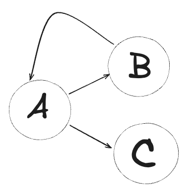

# OneMedisyn

<a alt="Nx logo" href="https://nx.dev" target="_blank" rel="noreferrer"></a>

✨ **This workspace has been generated by [Nx, a Smart, fast and extensible build system.](https://nx.dev)** ✨

# Propuesta One Medisyn MonoRepo

## Ventajas

- Todos los proyectos están dentro de un repositorio.
- El manejo de las dependencias es mucho más fácil.
- Se pueden dividir los equipos en diferentes aplicaciones o bibliotecas.
- Cada aplicación se compila por separado, por lo tanto, solo tomará lo que necesita de las bibliotecas. Ejemplo:

```jsx
NPX NX BUILD -APP-NAME --OPTIONS
```

Amigable con características especiales. Se podrán implementar cualquier característica por separado en cada aplicación sin afectar a las demás ni al paquete (bundle) de las otras.

- Todas las aplicaciones pueden manejar un solo estado SIEMPRE Y CUANDO ese estado se gestione en una biblioteca.
- Experiencia de desarrollo.

### Desventajas

- Puede ser más difícil de proteger debido a la gran cantidad de código y recursos alojados en un solo lugar.
- Puede ser difícil de dividir en caso de necesidad, ya que todo el código está alojado en un solo lugar.
- Puede ser más difícil de mantener la privacidad de algunos proyectos ya que todo el código está alojado en un solo lugar.

## Notas / Desafios

# PREVENIR LAS DEPENDENCIAS CIRCULARES


Libre de dependencias circular



Dependencia circular entre A y B . Error de compilacion.


---

### Ejemplo de aplicación de demostración.

Agenda y procedimientos están usando la biblioteca de AUTH. Por lo tanto, al momento de compilar, la incluirán en su paquete (bundle).

Nx ofrece **`npx nx graph`** para la generación de estos gráficos de dependencias.

[Explore the Graph](https://nx.dev/core-features/explore-graph)


- [ ]  Trabajar como apps separadas
    - [ ]  Para las aplicaciones, se deben definir puertos para el correcto funcionamiento.
    - [ ]  **`OneMedisyn`** sería la base. Por lo tanto, se debe hablar con **`DevOps`** para asegurar los puertos en cada despliegue.
    - [ ]  La autenticación (**`Auth`**) debe manejarse en la aplicación base **`OneMedisyn`**. .
    - [ ]  Se debe preparar un JSON con las rutas disponibles para la gestión de la navegación.
- [ ]  Para solucionar la autenticación (**`AUTH`**) en cada aplicación, se puede usar un token de actualización (**`refresh token`**) o tener un modal global para que el usuario pueda iniciar sesión fácilmente.
- [ ]  Se puede tener una aplicación de **`STATUS`** . Si una aplicación se cae, se reporta y las demás continúan funcionando.

### Trabajar en equipo por medio de ramas


